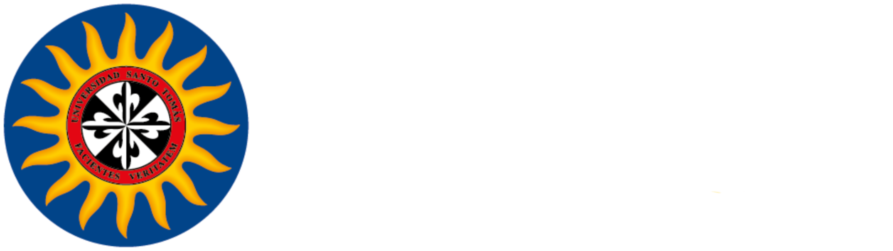

# 📚 INFORMACIÓN ACERCA DEL PROYECTO

## 📌 Definición
El proyecto consiste en realizar un **rediseño del sistema académico SAC**, descartando funciones poco esenciales y priorizando la experiencia del estudiante.  

---

## 👤 Información del Estudiante
En la parte superior de la plataforma se mostrará información básica del estudiante, como:  
- Nombre  
- CC / TI  

---

## 🧬 Acerca de nosotros
### ¿Quienes Somos?
La Universidad Santo Tomás es la primera universidad de Colombia,
fundada en 1580 por la Orden de Predicadores (Padres Dominicos). A
lo largo de más de cuatro siglos, ha sido referente en formación
humanista, académica y social, comprometida con el desarrollo del
país y con la promoción de valores éticos y ciudadanos.

### Nuestra misión
Formar integralmente a profesionales y ciudadanos capaces de
aportar al bien común mediante la investigación, la innovación, la
extensión y la docencia, inspirados en los principios de Santo
Tomás de Aquino: la verdad, la justicia y el servicio a la
sociedad.

### Nuestra visión
Ser reconocida nacional e internacionalmente como una universidad
de excelencia académica y humana, líder en investigación aplicada
y en la generación de proyectos que transformen la realidad social,
económica y cultural de Colombia y Latinoamérica.

### Presencia nacional
Contamos con una estructura multicampus que nos permite estar
presentes en diferentes ciudades del país, como Bogotá,
Bucaramanga, Medellín, Villavicencio y Tunja, además de Centros de
Atención Universitaria en otras regiones, garantizando así un
acceso más equitativo a la educación superior.

La Universidad Santo Tomás, fiel a su lema:
"Facientes Veritatem (Hacedores de la verdad), trabaja cada día 
por la formación integral de profesionales comprometidos con 
la sociedad colombiana.”


---

## 🏛️ Header
El header contendrá el título **SAC** y el **menú principal** con las siguientes secciones:  

---

## 📑 Menú Principal

### 📂 Matrícula
- Consulta de requisitos de matrícula  
- Recibo de pago de matrícula y otros derechos  
- Matrícula individual  
- Turno de matrícula asignado  
- Actualización de datos personales  

### 📂 Solicitudes
- Reintegro de estudiante  
- Solicitud de descuento  
- Solicitud de novedades de notas  
- Solicitud de certificados  
- Solicitud de tutorías  

### 📂 Horarios
- Lista de horarios del estudiante  
- Horario de grupos por programa  

### 📂 Información General
- Consulta de estudiantes  
- Plan de estudios individual  
- Horario del estudiante  
- Promedio  
- Notas registradas  
- Asistencia y comentarios de clase  

### 🎓 Servicio de Grado
- Solicitud de grado  
- Cargue de requisitos de matrícula  
- Programas extracurriculares para estudiantes  

---

## 🖼️ Imágenes a Utilizar
  

  


---

## 🎨 Colores Utilizados
```css
--background: #ffffff;
--foreground: #171717;

--color-gold: #febf35;
--color-cream: #fff9e5;
--color-brown: #7e6346;
--color-beige: #d3b89c;
--color-gray-dark: #444;

--brand-blue-900: #1a237e;        /* .title color */
--accent-gold: #f5c518;           /* subrayado .title y .postButton */
--accent-gold-hover: #e0b213;     /* hover del botón */
--scrollbar: #4753d4;             /* scrollbar-color */
--card-bg: #ffffff;               /* fondo .postCard */
--card-border: #eaeaea;           /* borde .postCard */
--tag-blue-bg: #e0ebff;           /* fondo .postTag */
--tag-blue-text: #2a4d9c;         /* texto .postTag */
--text-muted: #888;               /* .postDate */
--text-soft: #555;                /* .postDescription */
--text-soft-2: #6

## ✍️ Fuentes Tipográficas
En el proyecto se emplearán las siguientes tipografías:  
- **Inter** (regular, bold, italic)  
- **Lato** (regular, bold, italic)  
